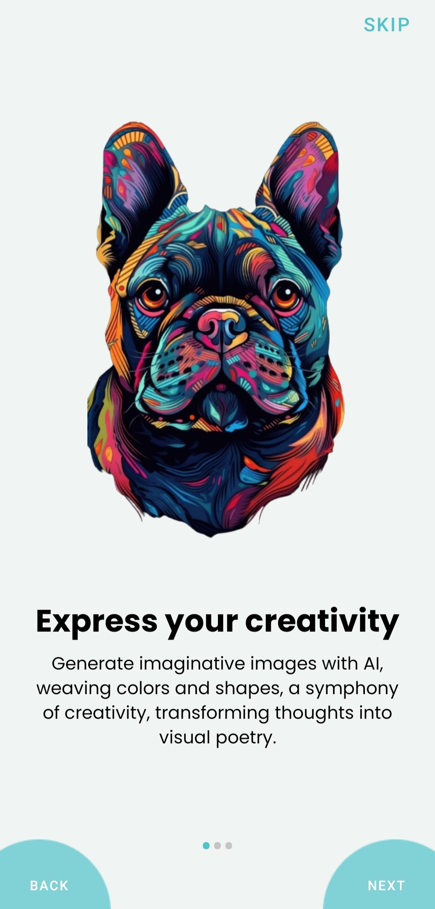
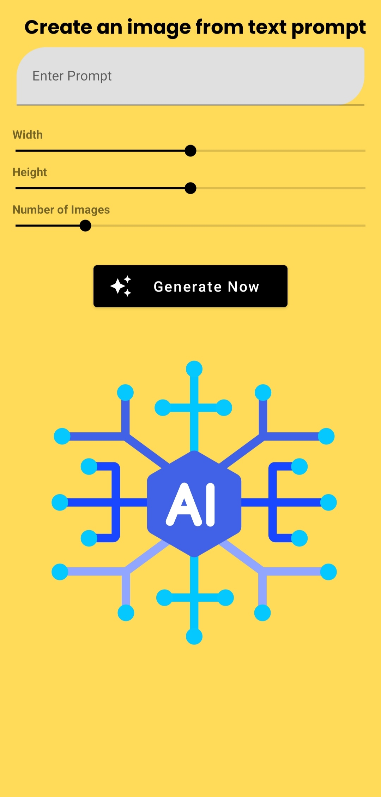
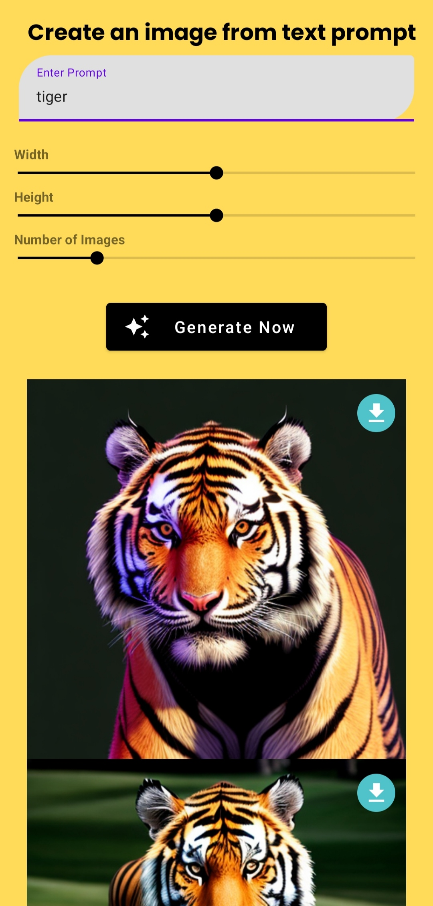
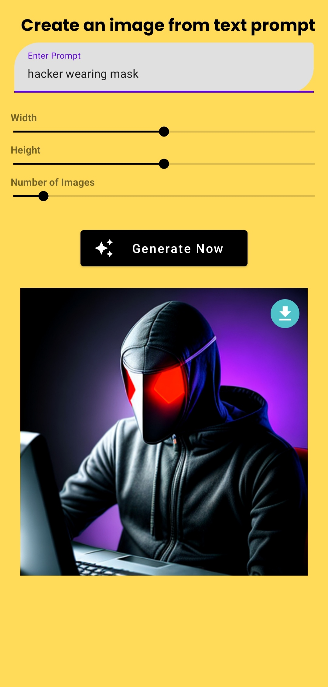
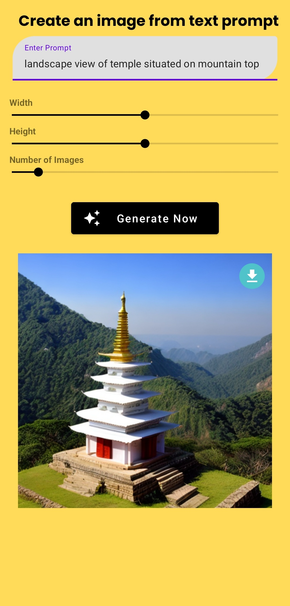

# 🤖 GeniArt

GeniArt is a cool app that you can use on your Android phone. It's like magic – you type in words, and it creates pictures for you! The smart people who made GeniArt used a special tool called Android Studio with a programming language called Java.

But here's the really interesting part: GeniArt also uses something called the Stable Diffusion API key (https://stablediffusionapi.com/). This API key is like a secret code that lets GeniArt talk to the Stable Diffusion tool. Think of it as GeniArt asking Stable Diffusion for help in making awesome images based on the words you type.

So, when you use GeniArt, you're not just getting any pictures – you're getting unique and cool images thanks to the power of Stable Diffusion. It's like having a creative friend who understands your words and turns them into beautiful artwork! Just type, and let the magic happen.

## 🖼️ Screenshot

  
  
  
  

  
  
  
  

## ✨ Features

- Generate imaginative images with AI
- Use Stable Diffusion to transform your imagination into images
- Interactive User Interface design
- Lottie Animation used for better experience
- Generate upto 10 images at a time
- Set height and width as per requirement

## 🛠️ Installation Step

- Download or clone the repo
- Visit Stable Diffusion website, create account and generate Api key (https://stablediffusionapi.com/)
- Paste your Api key in the ImageGenerator.java file and run the project

## 🖥️ Technologies Used

- Android Studio
- Java
- Stable Diffusion
- Lottie Animation

[Download the App](Apk/GeniArt.apk)

## 😃 If you liked the app, Please give it a ⭐ and fork the repository. 🙌  

